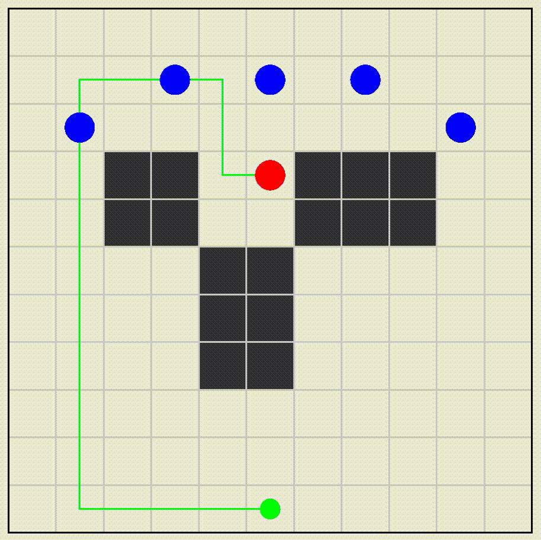
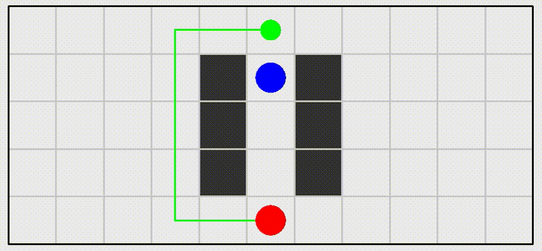
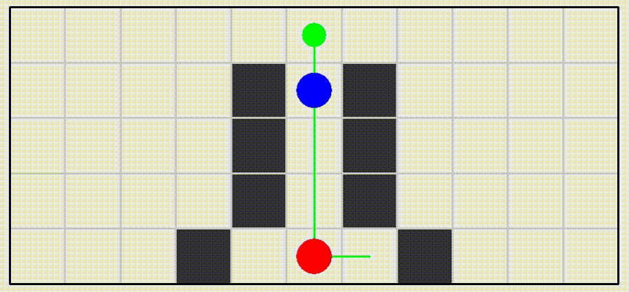
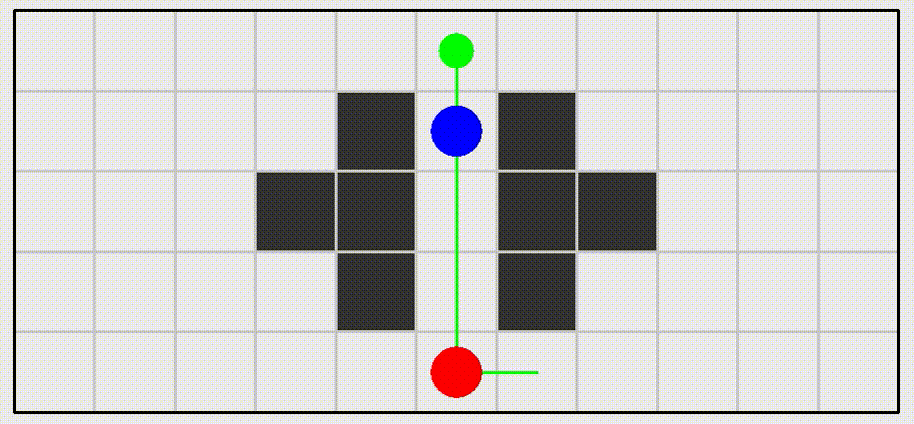
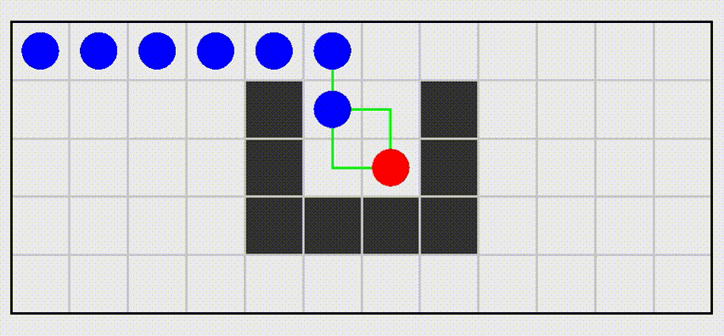

# Примеры работы алгоритма

Стены обозначены черными квадратиками, динамические препятствия синими кружочками, агент красным. Также зеленым показан путь (на его концах нарисованы зеленые кружки).

Все тесты соответствуют тестам в папке examples

+ Тест #000

    
+ Тест #001

    
+ Тест #002

    
+ Тест #003

    
+ Тест #004

    
+ Тест #005

    
